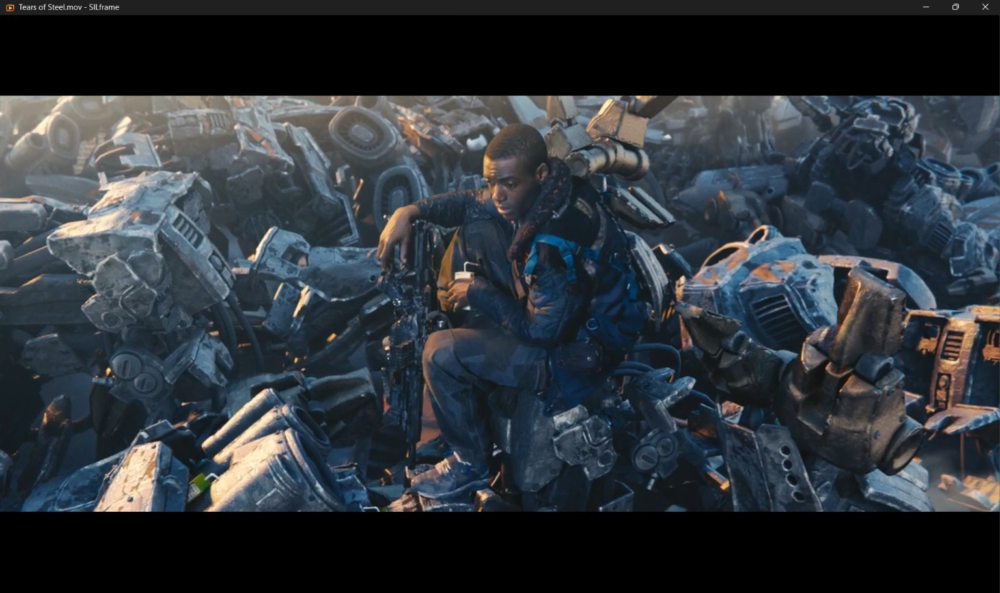
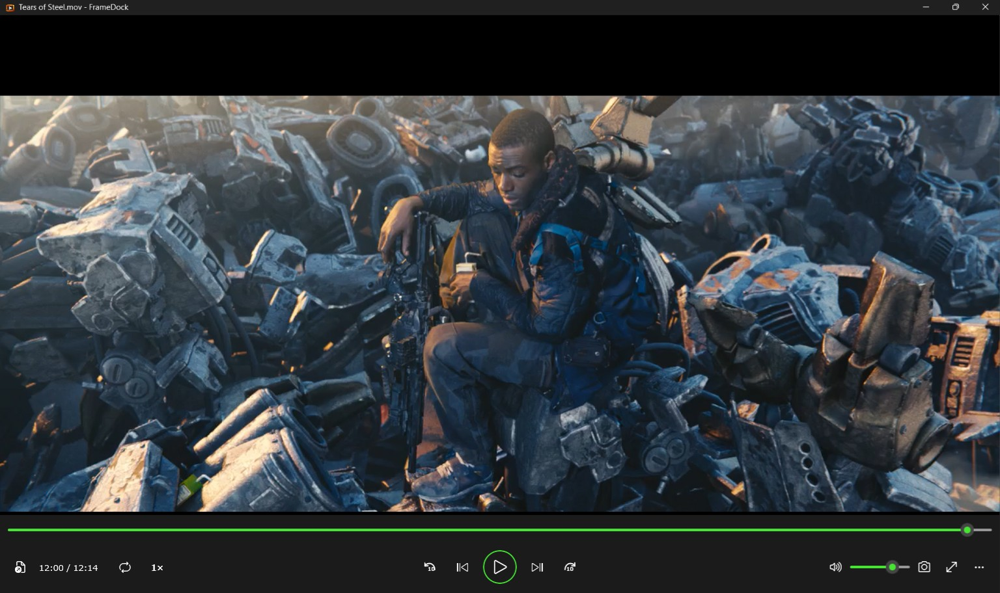
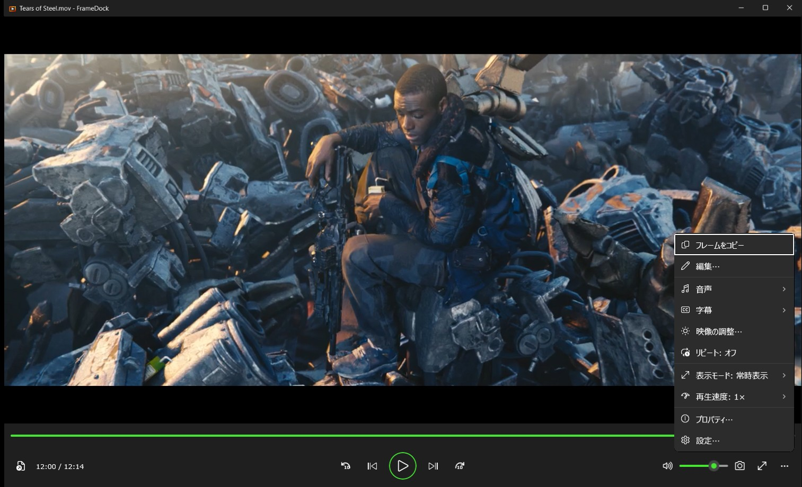
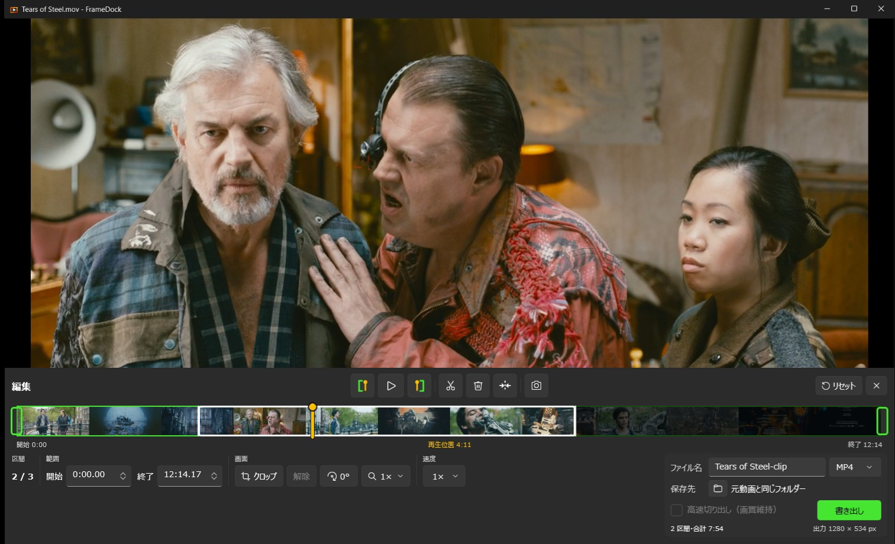

# FrameDock

[English](README.md)

FrameDock は、Windows 標準の動画再生アプリ（メディア プレーヤー）に足りない機能を補う目的で作った動画プレイヤーです。

なるべく Windows 標準アプリそのままの感覚で、学習無しで使えることを意識して作成しました。

普通の動画再生はもちろん、10 秒送り／10 秒戻し（秒数指定可能）、コマ送り／戻し、フレームの保存が可能です。

簡単な編集機能も備えており、トリミング、クロップ、回転、ズーム、速度変更、分割等を、動画編集ソフトを別で起動しなくても行うことができます。

## できること

- ローカルの動画ファイルを libmpv で再生します。
- 1 フレーム単位の移動と、10 秒スキップ／10 秒戻しができます（秒数は設定からカスタム可能）。
- 表示中のフレームを PNG で保存、またはクリップボードにコピーします。
- 音声トラックと字幕の切り替え、リピート再生、再生時の明るさ・コントラスト・彩度・色合いの調整ができます。
- 動画のプロパティ（解像度、フレームレート、コーデック、ビットレートなど）を表示し、まとめてコピーできます。
- 通常表示／ウィンドウ内最大化表示／全画面表示に対応しており、なるべく再生ボタンや不要なバー等が再生画面に被らないように意識しています。
- アプリを切り替えずに、簡単な動画編集機能を使用することができます。
- 指定の区間をトリミングできます。
- 解像度クロップ、90 度単位の回転、1×〜4× のズーム、0.5×〜4× の速度変更をプレビューしながら設定し、別動画として保存できます。
- 動画を複数カットに分割し、分割ごとの編集に対応しています。
- ほかの編集をしていないときは、再エンコードなしで切り出せます（高速切り出し）。
- 書き出し形式は MP4 / MKV / MOV です。映像は H.264、音声は AAC。
- 表示言語は日本語と英語です。

## スクリーンショット

操作バーはウィンドウ内最大化と全画面表示では隠れていて、ポインターをウィンドウの下端に寄せると現れます。

「その他の操作」（**…** ボタン）から、フレームのコピー、編集、音声と字幕の切り替え、映像の調整、リピート、表示モード、再生速度、プロパティ、設定を開けます。

編集パネルは映像の下に開きます。この画像は、動画を 3 つの区間に分割し、最後の区間を削除した状態です。

スクリーンショットの映像は [*Tears of Steel*](https://mango.blender.org/)（(CC) Blender Foundation、[CC BY 3.0](https://creativecommons.org/licenses/by/3.0/)）です。

## インストール

Windows 10 バージョン 2004（ビルド 19041）以降、または Windows 11 の x64 で動作します。

1. [Releases](../../releases) から `FrameDock-Setup-<バージョン>-win-x64.exe` をダウンロードします。
2. 実行します。セットアップはコード署名をしていないため、Windows SmartScreen が「Windows によって PC が保護されました」と表示する場合があります。**詳細情報** を選び、**実行** を選びます。
3. 画面に従って進めます。現在のユーザー用に `%LOCALAPPDATA%\Programs\FrameDock` へインストールし、管理者権限は不要です。

セットアップには必要なものがすべて入っており、追加のダウンロードはありません。デスクトップアイコンと、一般的な動画形式への「プログラムから開く」の登録は任意です。Windows の既定のアプリは変更しません。削除するときは、Windows の設定の **インストールされているアプリ** から行います。

## 使い方

### 再生

- **動画を開く** ボタン（Ctrl+O）か、ウィンドウへのドラッグ＆ドロップで動画を開きます。
- 下部の操作バーで、再生と一時停止、スキップ、1 フレームの移動、音量の調整をします。
- 「その他の操作」→ **表示モード** で、操作バーを映像の下に常に表示する、最大化、全画面表示を切り替えます。
- 「その他の操作」→ **再生速度** で、視聴時の速度を設定します。
- 「その他の操作」→ **リピート** で、動画の繰り返し再生を切り替えます。
- 「その他の操作」→ **音声** / **字幕** で、動画に含まれるトラックを切り替えます。字幕は **字幕ファイルを開く…** で外部のファイルも読み込めます。
- 「その他の操作」→ **映像の調整…** で、明るさ、コントラスト、彩度、色合いを調整します。再生時の表示だけに適用され、編集、書き出し、フレーム画像には反映されません。アプリを終了すると元に戻ります。
- 「その他の操作」→ **プロパティ…** で、ファイル、映像、音声の情報を表示します。**すべてコピー** でテキストとしてコピーできます。
- タイトルバーには、開いている動画のファイル名が表示されます。

### フレームの保存

- カメラのボタン（Ctrl+S）は、表示中のフレームを PNG で保存します。ファイル名には動画名と再生時刻が入り、既存のファイルは上書きしません。
- 編集パネルを開いているときは、再生ボタンの並びにあるカメラのボタン（Ctrl+S）で、クロップ、回転、ズームを反映した見えているままのフレームを、書き出しと同じサイズで保存します。
- 保存すると通知にパスが表示され、**フォルダーを開く** で保存先を開けます。
- 映像を右クリックすると、表示中のフレームをクリップボードにコピーできます。
- 保存先は **設定** で選びます。`ピクチャ\FrameDock`（既定）、指定したフォルダー、動画と同じフォルダー、動画と同じ場所のサブフォルダーのいずれかです。選んだ場所に書き込めない場合は `ピクチャ\FrameDock` に保存します。

### 編集と書き出し

「その他の操作」→ **編集…** で編集パネルを開きます。

1. **範囲。** 再生位置を合わせて、`[` のボタン（I）で開始点、`]` のボタン（O）で終了点を設定します。タイムライン上の範囲をドラッグするか、時刻を `0:12.5` の形式または秒数で入力しても調整できます。
2. **画面。** **クロップ** を押すと 8 つのハンドルが出るので、範囲を調整して **完了** を押します。**解除** でクロップを外します。回転ボタンは押すたびに時計回りに 90 度回転します。**ズーム** は 4× まで拡大でき、拡大中は映像をドラッグして位置を調整できます。
3. **速度。** プレビューと書き出しの速度です。視聴時の速度とは別に設定します。
4. **分割。** ハサミのボタン（S）は再生位置で分割します。クロップ、回転、ズーム、速度は、再生位置がある区間にだけ適用されます。ごみ箱のボタン（Delete）はその区間を削除し、もう一度押すと元に戻します。その右のボタンは前の区間と結合します。
5. **書き出し。** ファイル名、形式、保存先を決めて **書き出し** を押します。書き出し後のサイズはボタンの下に表示されます。完了すると通知が出て、**フォルダーを開く** で保存先を開けます。

残した区間は順につなげて 1 つのファイルにします。区間によってサイズが異なる場合は、最初の区間のサイズに合わせ、ほかの区間は縦横比を保ったまま黒い余白を付けて収めます。

**高速切り出し（画質維持）** は、映像と音声を再エンコードせずにコピーします。切り出し位置は近いキーフレームに移動するため、指定した時刻と前後することがあります。クロップ、回転、ズーム、速度変更、複数区間の書き出しとは併用できません。

**リセット** は編集内容をすべて最初の状態に戻します。**×** は編集内容を残したまま編集パネルを閉じます。別の動画を開くと編集内容は初期化されます。

### キーボード操作

| キー | 動作 |
|---|---|
| Space | 再生／一時停止 |
| ← → | 設定した秒数だけ戻る／進む |
| `,` `.` | 1 フレーム戻る／進む |
| F | 全画面表示の切り替え |
| Esc | 全画面表示の終了、またはクロップの完了 |
| Ctrl+O | 動画を開く |
| Ctrl+S | 表示中のフレームを保存 |
| I、O | 編集中: 再生位置を開始点／終了点にする |
| S | 編集中: 再生位置で分割 |
| Delete | 編集中: 区間の削除と復元 |

シークバーや音量バーにフォーカスがあるときの矢印キーは、そのバーの操作になります。

### 設定

「その他の操作」→ **設定…** で、スキップする秒数、フレーム画像の保存先、表示言語を設定します。表示言語は、既定では Windows の表示言語に従います。変更は次回の起動時に反映されます。

エラーの詳細は `%LOCALAPPDATA%\FrameDock\error.log` に記録されます。

## 制限

- 入力と出力はローカルファイルです。出力形式は MP4 / MKV / MOV です。
- 書き出しに含まれる音声は、動画の最初の音声トラックです。再生時に選んだ音声トラックと字幕は、書き出しには反映されません。
- 再エンコードはソフトウェアエンコーダーの `libx264`（H.264）と AAC を使います。GPU エンコーダーは使いません。
- HDR 動画は、色が変わるのを避けるため再エンコードしません。「高速切り出し（画質維持）」であれば、メタデータを保ったまま書き出せます。
- クロップの位置と大きさは偶数ピクセルにそろえます。クロップなしで幅か高さが奇数の動画は、右端または下端に最大 1 ピクセルを追加します。
- 書き出しは既存のファイルを上書きしません。元の動画を保存先に指定することもできません。
- 速度を上げた区間が複数あると、つなぎ目が最大 2 フレームほどずれることがあります。全体の長さは正しくなります。

## ビルド

ビルド、テスト、インストーラーの作成は [docs/BUILDING.ja.md](docs/BUILDING.ja.md) を参照してください。書き出しライブラリの仕様は [EXPORT-NOTES.md](EXPORT-NOTES.md) にあります。

## ライセンス

FrameDock のライセンスは [GNU General Public License v3.0](LICENSE) です。

インストーラーには FFmpeg（GPLv3 のビルド）、libmpv（LGPLv2.1 以降）、Microsoft Windows App SDK を同梱しています。入手元、バージョン、ハッシュ、ライセンス文書は [THIRD-PARTY-LICENSES.md](THIRD-PARTY-LICENSES.md) に記載しており、ライセンス文書はインストール先の `ThirdPartyNotices` フォルダーに入ります。
