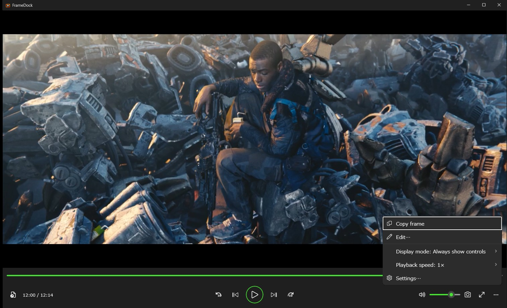
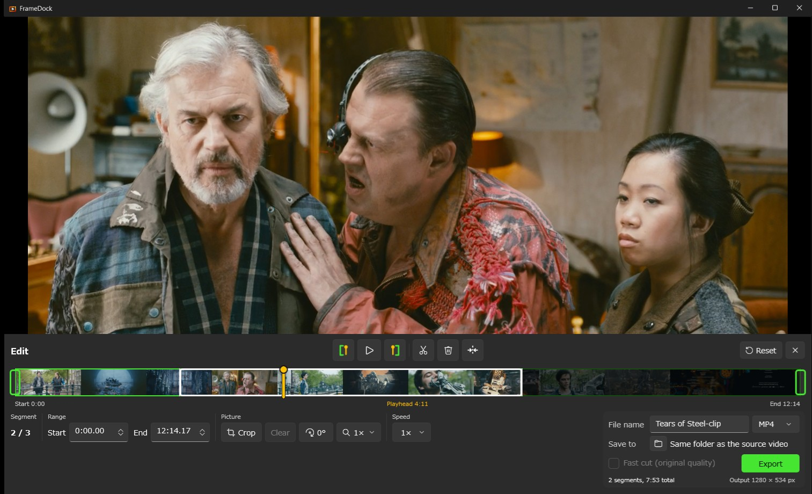

# FrameDock

[日本語](README.ja.md)

FrameDock is a video player for Windows, made to add what the built-in Media Player app lacks. It opens a video and plays it like any player, and in the same window you can step frame by frame, save frames, and trim, crop, rotate, zoom, change speed, split, and export.

## What it does

- Plays local video files with libmpv, with frame-by-frame stepping and a configurable skip interval.
- Saves the current frame as a PNG, or copies it to the clipboard.
- Trims a range and exports it as MP4, MKV, or MOV (H.264 video and AAC audio).
- Crops, rotates in 90° steps, zooms 1×–4×, and changes speed 0.5×–4× for the export, with a live preview.
- Splits the range into segments. Each segment has its own crop, rotation, zoom, and speed, and segments can be deleted. The remaining segments are exported as one file.
- Cuts without re-encoding ("Fast cut") when no other edit is applied.
- Shows its interface in English or Japanese.

## Screenshots

In the maximized and full-screen modes the controls stay out of the way and appear when you move the pointer to the bottom of the window.

"Edit and more" (the **…** button) opens the menu for copying a frame, the editor, the display mode, the playback speed, and the settings.

The editor opens below the video. This screenshot shows a video split into three segments, with the last one deleted.

The screenshots show [*Tears of Steel*](https://mango.blender.org/), (CC) Blender Foundation, licensed under [CC BY 3.0](https://creativecommons.org/licenses/by/3.0/).

## Install

FrameDock runs on Windows 10 version 2004 (build 19041) or later and Windows 11, x64.

1. Download `FrameDock-Setup-<version>-win-x64.exe` from the [Releases](../../releases) page.
2. Run it. The setup is not code-signed, so Windows SmartScreen may show "Windows protected your PC". Select **More info**, then **Run anyway**.
3. Follow the setup. It installs for the current user into `%LOCALAPPDATA%\Programs\FrameDock` and needs no administrator rights.

The setup contains everything FrameDock needs and downloads nothing. A desktop icon and an "Open with" entry for common video formats are optional. FrameDock does not change your default apps. To remove it, use **Installed apps** in Windows Settings.

## Use

### Play

- Open a video with the **Open video** button (Ctrl+O), or drop a file onto the window.
- The controls along the bottom play and pause, skip, step one frame, and set the volume.
- "Edit and more" → **Display mode** switches between always showing the controls below the video, a maximized window, and full screen.
- "Edit and more" → **Playback speed** sets the viewing speed.

### Save a frame

- The camera button (Ctrl+S) saves the current frame as a PNG. The file name contains the video name and the playback time, and an existing file is never overwritten.
- A notification shows the full path, with an **Open folder** button.
- Right-click the video to copy the current frame to the clipboard.
- **Settings** chooses where frames go: `Pictures\FrameDock` (the default), a folder you choose, the folder of the video, or a subfolder next to the video. If that location can't be written to, the frame is saved to `Pictures\FrameDock`.

### Edit and export

Open the editor with "Edit and more" → **Edit…**.

1. **Range.** Move the playhead and set the start with the `[` button (I) and the end with the `]` button (O). You can also drag the range on the timeline, or type times as `0:12.5` or in seconds.
2. **Picture.** **Crop** shows eight handles; adjust the area and select **Done**. **Clear** removes the crop. The rotate button turns the picture 90° clockwise each time. **Zoom** magnifies up to 4×, and while zoomed in you can drag the video to reposition it.
3. **Speed.** Sets the speed of the preview and the export, separately from the viewing speed.
4. **Split.** The scissors button (S) splits at the playhead. Crop, rotation, zoom, and speed apply only to the segment under the playhead. The trash button (Delete) deletes that segment, and pressing it again restores it. The button to its right merges the segment with the previous one.
5. **Export.** Set the file name, the format, and the destination folder, then select **Export**. The output size is shown under the button. When the export finishes, a notification offers **Open folder**.

Kept segments are joined in order into one file. If segments differ in size, the first kept segment sets the output size and the others are fitted inside it with black bars.

**Fast cut (original quality)** copies the video and audio without re-encoding. The cut points move to the nearest keyframes, so they can differ from the times you set. It can't be combined with crop, rotation, zoom, speed changes, or more than one segment.

**Reset** returns every edit to its initial state. **×** closes the editor and keeps your edits. Opening another video clears them.

### Keyboard

| Key | Action |
|---|---|
| Space | Play or pause |
| ← → | Skip back or forward by the interval in Settings |
| `,` `.` | Step one frame back or forward |
| F | Enter or leave full screen |
| Esc | Leave full screen, or finish cropping |
| Ctrl+O | Open a video |
| Ctrl+S | Save the current frame |
| I, O | In the editor: set the start or end to the playhead |
| S | In the editor: split at the playhead |
| Delete | In the editor: delete or restore the segment |

When the seek bar or the volume slider has focus, the arrow keys move that slider.

### Settings

"Edit and more" → **Settings…** sets the skip interval, where frames are saved, and the display language. By default FrameDock follows the Windows display language. A language change takes effect the next time FrameDock starts.

Error details are written to `%LOCALAPPDATA%\FrameDock\error.log`.

## Limits

- Input and output are local files. Output formats are MP4, MKV, and MOV.
- Re-encoding uses the software encoder `libx264` (H.264) and AAC. No GPU encoder is used.
- HDR video is not re-encoded, to avoid changing its colors. HDR can be exported with "Fast cut (original quality)", which keeps its metadata.
- Crop positions and sizes are aligned to even pixels. An uncropped video with an odd width or height gets at most one pixel added on the right or bottom edge.
- An export never overwrites an existing file, and the source video can't be the destination.
- When several segments have their speed raised, a join can be off by up to about two frames. The total length is correct.

## Build

See [docs/BUILDING.md](docs/BUILDING.md) for building, testing, and creating the installer. [EXPORT-NOTES.md](EXPORT-NOTES.md) describes the export library.

## License

FrameDock is licensed under the [GNU General Public License v3.0](LICENSE).

The installer bundles FFmpeg (a GPLv3 build), libmpv (LGPLv2.1 or later), and the Microsoft Windows App SDK. Their sources, versions, hashes, and license texts are listed in [THIRD-PARTY-LICENSES.md](THIRD-PARTY-LICENSES.md), and the license texts are installed in the `ThirdPartyNotices` folder.
